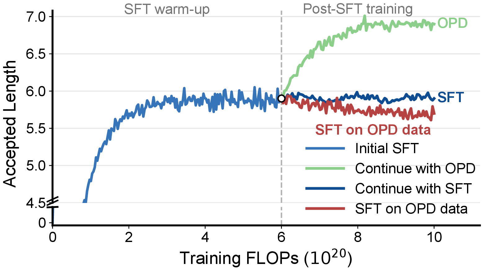
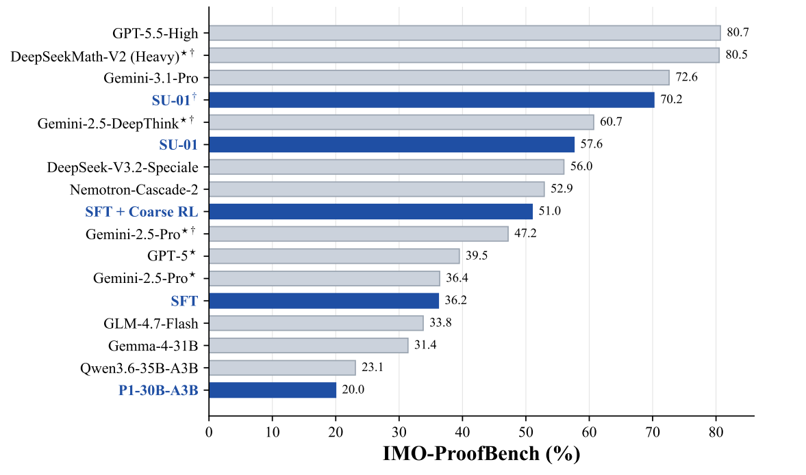
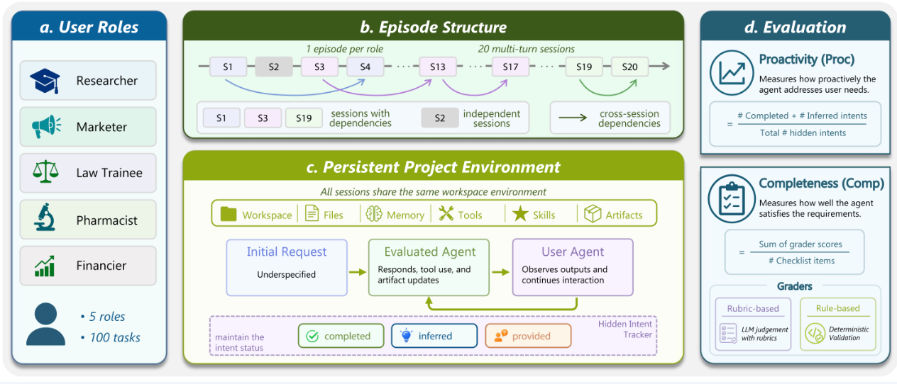

## About Me

Nice to meet you! I am a 4th-year undergraduate student at Nanjing University(NJU), and also a incoming 26 Fall Ph.D student in School of Artificial Intelligence at Shanghai Jiao Tong University (SJTU) and Shanghai AI Laboratory, advised by Prof. [Ning Ding](https://www.stingning.cn/) and Prof. [Bowen Zhou](https://web.ee.tsinghua.edu.cn/zhoubowen/zh_CN/index.htm). I am also fortunate to work closely with Dr. [Yafu Li](https://yafuly.github.io/), Dr. [Yun Luo](https://luoxiaoheics.github.io/), and Dr. [Ganqu Cui](https://cgq15.github.io/).

My research interests mainly focus on Reasoning and Efficiency of LLMs, such as Speculative Decoding, Multi-Token Prediction, and how to build strong reasoning systems via reinforcement learning. If you are interested in these topics, feel free to contact me!

<!-- - **Machine Learning:** meta-learning, incremental learning, transfer learning -->

## News

- *2026.06*: We released **[Draft-OPD](./draft-opd/)**, an on-policy distillation method for speculative draft models. By replaying draft-induced errors from target-assisted rollouts, it improves the lossless decoding speed of thinking models while preserving the target model's output distribution.
- *2026.05*: Our team released a [30B-A3B reasoning model](https://simplified-reasoning.github.io/SU-01/) that reaches gold-medal level across both physics (IPhO) and math Olympiad (IMO) evaluations, comparable to GPT 5.5, Gemini 3.1 Pro and DeepSeek V3.2 Speciale.
- *2025.11*: Joined Shanghai AI Lab as a research intern.
- *2025.10*: Honored to receive the 2025 National Scholarship of China.
- *2025.07*: I am joining WestLake NLP group as a on site research intern.

## Selected Papers (Full list on <a href="https://scholar.google.com/citations?user=32JOcqYAAAAJ&hl=en&oi=ao">Google Scholar</a>) {#selected-papers}

<ol class="bibliography">

<!-- ===================== 论文一：Draft-OPD ===================== -->
<li>

  

    
    <abbr class="badge">Preprint</abbr>
  

  

      
<a href="./draft-opd/">Draft-OPD: On-Policy Distillation for Speculative Draft Models</a>

      
<strong>Haodi Lei</strong>, Yafu Li, Haoran Zhang, Shunkai Zhang, Qianjia Cheng, Xiaoye Qu, Ganqu Cui, Bowen Zhou, Ning Ding, Yun Luo, Yu Cheng

      
<em>Preprint, 2026.</em>

      
Post-trains speculative draft models on the states they actually induce during verification. By replaying draft-induced errors from target-assisted rollouts, it improves the lossless decoding speed of thinking models while preserving the target model's output distribution.

    

      <a href="https://arxiv.org/abs/2605.29343" class="btn btn-sm z-depth-0" role="button" target="_blank" style="font-size:12px;">arXiv</a>
      <a href="https://github.com/bingyang-lei/Draft-OPD" class="btn btn-sm z-depth-0" role="button" target="_blank" style="font-size:12px;">Code</a>
      <a href="https://huggingface.co/collections/bingyang-lei/draft-opd" class="btn btn-sm z-depth-0" role="button" target="_blank" style="font-size:12px;">Models</a>
      <a href="./draft-opd/" class="btn btn-sm z-depth-0" role="button" target="_blank" style="font-size:12px;">Project Page</a>
    

  

</li>
 

<!-- ===================== 论文二：SU-01 ===================== -->
<li>

  

    <!-- 图片待补充：把图放到 assets/img/ 下，取消下一行注释并填好文件名即可 -->
    <!--  -->
    <abbr class="badge">Preprint</abbr>
  

  

      
<a href="https://simplified-reasoning.github.io/SU-01/">Achieving Gold-Medal-Level Olympiad Reasoning via Simple and Unified Scaling</a>

      
Yafu Li, Runzhe Zhan, Haoran Zhang, Shunkai Zhang, Yizhuo Li, Zhilin Wang, Jiacheng Chen, Futing Wang, Xuyang Hu, Yuchen Fan, Bangjie Xu, Yucheng Su, Xinmiao Han, Chenxi Li, <strong>Haodi Lei</strong>, Yufeng Zhao, Zejin Lin, Qianjia Cheng, Tong Zhu, Xiaoye Qu, Ganqu Cui, Peng Ye, Yun Luo, Zhouchen Lin, Yu Qiao, Bowen Zhou, Ning Ding, Yu Cheng

      
<em>Preprint, 2026.</em>

      
SU-01, a 30B-A3B reasoning model, reaches gold-medal level across both physics (IPhO) and math Olympiads (IMO) through simple and unified scaling, performing comparably to GPT 5.5, Gemini 3.1 Pro and DeepSeek V3.2 Speciale.

    

      <a href="https://arxiv.org/abs/2605.13301" class="btn btn-sm z-depth-0" role="button" target="_blank" style="font-size:12px;">arXiv</a>
      <a href="https://github.com/Simplified-Reasoning/SU-01" class="btn btn-sm z-depth-0" role="button" target="_blank" style="font-size:12px;">Code</a>
      <a href="https://huggingface.co/Simplified-Reasoning/SU-01" class="btn btn-sm z-depth-0" role="button" target="_blank" style="font-size:12px;">Model</a>
      <a href="https://simplified-reasoning.github.io/SU-01/" class="btn btn-sm z-depth-0" role="button" target="_blank" style="font-size:12px;">Project Page</a>
    

  

</li>
 

<!-- ===================== 论文三：π-Bench ===================== -->
<li>

  

    <!-- 图片待补充：把图放到 assets/img/ 下，取消下一行注释并填好文件名即可 -->
    <!--  -->
    <abbr class="badge">Preprint</abbr>
  

  

      
<a href="https://simplified-reasoning.github.io/Pi-Bench/">π-Bench: Evaluating Proactive Personal Assistant Agents in Long-Horizon Workflows</a>

      
Haoran Zhang, Luxin Xu, Zhilin Wang, Runquan Gui, Shunkai Zhang, <strong>Haodi Lei</strong>, Zihao He, Bingsu He, Chicheng Qin, Tong Zhu, Xiaoye Qu, Yang Yang, Yu Cheng, Yafu Li

      
<em>Preprint, 2026.</em>

      
A benchmark that evaluates whether proactive personal assistant agents can infer hidden user requirements in long-horizon, multi-turn workflows, measuring both Proactivity (reducing the user's specification burden) and Completeness (satisfying explicit and implicit requirements).

    

      <a href="https://arxiv.org/abs/2605.14678" class="btn btn-sm z-depth-0" role="button" target="_blank" style="font-size:12px;">arXiv</a>
      <a href="https://github.com/Simplified-Reasoning/Pi-Bench" class="btn btn-sm z-depth-0" role="button" target="_blank" style="font-size:12px;">Code</a>
      <a href="https://github.com/Simplified-Reasoning/Pi-Bench/tree/main/data" class="btn btn-sm z-depth-0" role="button" target="_blank" style="font-size:12px;">Data</a>
      <a href="https://simplified-reasoning.github.io/Pi-Bench/" class="btn btn-sm z-depth-0" role="button" target="_blank" style="font-size:12px;">Project Page</a>
    

  

</li>
 

</ol>

<!--  -->

## Honors and Awards

- *2025.10* National Scholarship(¥10,000)
- *2025.01* Provincial college student innovation project, with ¥5000 of funding support. 
- *2024.05* Finalist Award (Top 1.5%), COMAP's Mathematical Contest in Modeling (MCM)
- *2023.10* Nanjing University Excellence Scholarship (¥8,000)

## Working Experiences

- *2025.03 - 2025.09*, NLP Group, advised by Prof. Yue Zhang, Westlake University.
- *2024.07 - 2025.04*, Knowledge Garden Group, advised by Prof. Wei Hu, Nanjing University.

<!-- - **[Feb. 2020]** Our paper about incremental learning is accepted to CVPR 2020.
- **[Feb. 2020]** We will host the ACM Multimedia Asia 2020 conference in Singapore!
- **[Sept. 2019]** Our paper about few-shot learning is accepted to NeurIPS 2019.
- **[Mar. 2019]** Our paper about few-shot learning is accepted to CVPR 2019.



 -->
